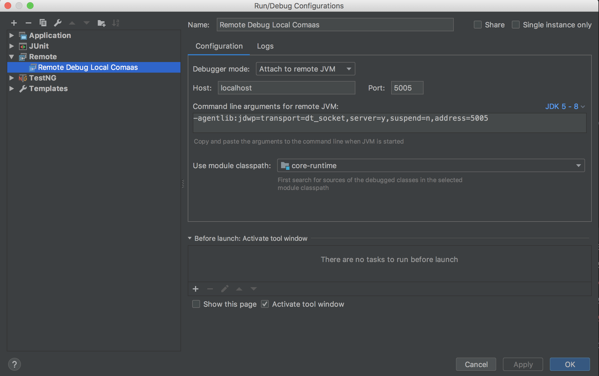

# Comaas central

## Dev setup

* Follow the steps mentioned [here](https://github.corp.ebay.com/ecg-comaas/central/wiki#set-up-code-review) to clone this repository.
* Run `git submodule update --init`
* Setup Docker

### Docker

Install [Docker](https://docs.docker.com/engine/installation/mac/) to be able to run tests. Alternatively, `brew cask install docker` and start `Docker.app`.

One time setup:

`docker login dock.es.ecg.tools`

Start all Comaas supporting services by checking out https://github.corp.ebay.com/ecg-comaas/ecg-comaas-docker:
```
cd ecg-comaas-docker
make up
```
Remove all containers using `cd docker; make down`

Note that you will have to install Docker on your local machines, the automated tests rely on it.

### Run/Debug COMaaS for a specific tenant

- Run Docker Containers - `docker` project `make up logs`
- Load properties from the root of `central` project

```
./bin/opt/docker-load-consul-properties.sh $TENANT_NAME
```
This should say something like: 
```
(...)
2018/12/07 13:28:48 Importing 79 properties into Consul at http://comaasdocker_consul_1:8500/v1/kv/comaas/comaas:core:kjca
```

- Run Configuration in IntelliJ


Please note that this would only allow you debugging the core system, but none of the plugins (filters, post/pre processors, or message centers)

### Run/debug Comaas with plugins
 - Start Comaas docker and load properties as described above.
 - Build the project with
  ```
./bin/build.sh -p
  ```
 - Create Remote configuration and run it
 
 
 
 - Use `bin/opt/run-locally.sh` to start Comaas. 
 - When you make any changes to the code you need to build the project again and re-start comaas for the changes to be 
 reflected.
 
#### Option 1. Build script

```
./bin/build.sh -p
```

### Testing that your setup works

In the docker repo, run `make send`. This puts a message in the `mp_messages`  kafka topic (assuming tenant is mp). 

After being succesfully processed in the Trust & Safety pipeline, the approved message should show up in the `conversation_events`  topic , which you can check at [http://localhost:8073/#/cluster/default/topic/n/conversation_events/data](http://localhost:8073/#/cluster/default/topic/n/conversation_events/data) . 

## Auto-discovery of (cloud) services and properties (Consul)
COMaaS has support for auto-discovery of some cloud services (currently Cassandra, when registered in Consul) as well as configuration properties (Consul KV).

### Consul services
The application will automatically scan for other Consul-registered services. Currently this is Cassandra, Kafka, and ElasticSearch.

### Consul configuration (KV)
In order to add keys to consul, add them with the prefix `comaas/comaas:core:<tenant long name>`. E.g. `comaas/comaas:core:ebayk/persistence.strategy` with value `cassandra`. This prefix approach allows one Consul instance to contain properties for multiple tenants (or the same tenant running on multiple ports).
